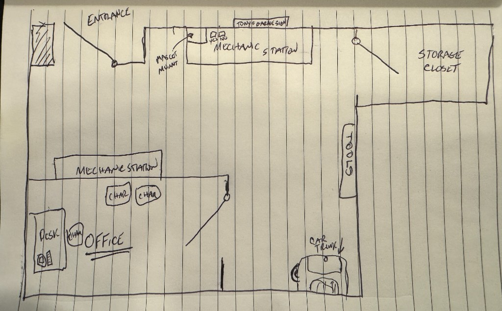

# Floorplan

Source sketch (v1, hand-drawn):

## Format reminder

**Three physical rooms**, one group: **Main** (largest garage bay) · **Storage** (small) · **Office** (mid-size). Tools Closet is not a fourth room. Vocabulary: [`zones-and-containers.md`](./zones-and-containers.md).

## Room-by-Room Read

### Entrance

- Single door, top-left area, swinging into the Main Garage Bay.
- A shaded/hatched box is drawn on the wall right next to the entrance — **confirmed as the fake upstairs window** Frank watches from. Main has double-height ceiling clearance here, so the window can sit genuinely high on the wall. Full mechanism concept and feasibility notes: [`../05-Software-Electronics/props/upstairs-window/README.md`](../05-Software-Electronics/props/upstairs-window/README.md).

### Main Garage Bay (largest room — center/top open bay)

- Runs along the whole top of the layout, from the entrance across to the Storage door.
- **"Tony's Garage" sign** — mounted here, this is the sign that gets a second illuminated line ("...IS FOR FAMILY") in the YES ending.
- **Mechanic Station (main/public)** — the working bay itself; icon sketched suggests a tool chest/lift or similar equipment. Leading idea: a physical puzzle built around an engine and/or lift knobs and pulleys, producing something usable elsewhere in the room (not yet designed — see idea backlog in [`../03-Flow/puzzle-dependency-map.md`](../03-Flow/puzzle-dependency-map.md)).
- **Mascot Mount** — explicitly marked with an arrow, positioned near the sign/mechanic station. This is the "mantle" from the story — where Sparky gets placed at the finale, and where the finale monitor lives.
- Early clues live here too: a photo ID of Uncle Tony, and a recording of Tony discussing "the Don" and the old man — see the clue triangulation mechanic in [`../01-Story/narrative-arc.md`](../01-Story/narrative-arc.md).
- **Car w/ trunk** — parked at the bottom-right of the bay, near the Tools Closet. The **trunk is a container** (not a zone), holding Sparky; opened **last** after Storage and Office. Frank's "dead thing in the trunk."
- A short freestanding vertical line is sketched between the Office and the car — possibly a support pillar/post. Flagging as a physical/structural note rather than a story element unless you intend otherwise.

### Storage (top-right, enclosed) — **small room**, accessed first

- Own walls, with a door (swing shown) connecting to the Main Garage Bay.
- Confirmed contents: a photo of Tony shaking hands with the (unnamed) Chief of Police. Also the likely home for bulk evidence (filing cabinet, boxes, older records) — exact split vs. Office still TBD.
- May hold several puzzle gates, or one larger puzzle, to earn entry/exit — not yet designed.

### Office (bottom-left, enclosed) — **mid-size room**, accessed second

- Its own four walls, with a door (swing shown) connecting to the Main Garage Bay.
- Largest of the two gated rooms; smaller than Main. Labeled with a second **"Mechanic Station"** at the top of this room, and **"Office"** (underlined) as the specific area within it containing:
  - Desk
  - 2–3 chairs
- Working read: this is **Tony's private workspace** — part personal mechanic bench, part office desk — separate from the public-facing bay.
- Confirmed contents: a labeled photo of Chief **Dawn Adams**, which completes the name-triangulation with Storage's handshake photo (see [`../01-Story/narrative-arc.md`](../01-Story/narrative-arc.md)). Also likely home for personal paperwork (calendar, ledger).

### Tools Closet (right side, narrow, enclosed) — **container**, not a 4th room

- Closet / container (or sub-area of Main), **not** a fourth room. Confirm if needed — see [`zones-and-containers.md`](./zones-and-containers.md).
- Runs vertically along the right wall, below Storage.
- No door swing drawn — either open off Main, or nested through Storage. Still open.
- Leading concept: **power source** to route elsewhere; or nested puzzle gates. Not yet designed.

## Door/Access Summary (as sketched)

| Connection | Door Shown? |
|---|---|
| Outside → Main Garage Bay (Entrance) | Yes |
| Main Garage Bay → Office | Yes |
| Main Garage Bay → Storage Closet | Yes |
| Main Garage Bay or Storage Closet → Tools Closet | Not shown — needs clarification |

## Revision Notes

- v1: initial hand sketch from Russell, captured 2026-08-06.
- 2026-08-10: format clarified — **three-room escape** (Main largest, Storage small, Office mid-size), not "one room with zones."
